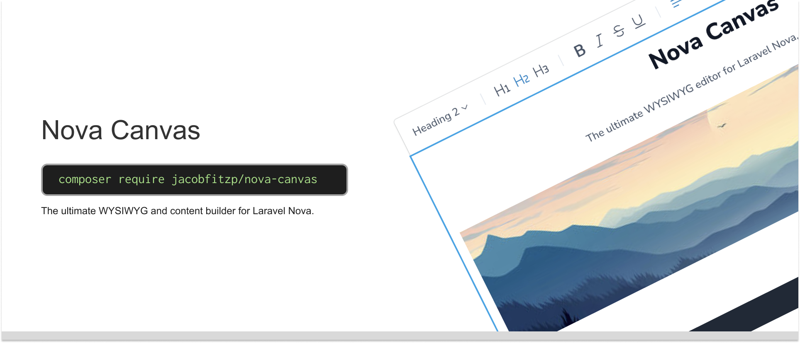

# Nova Canvas




<a href="https://codeclimate.com/github/JacobFitzp/nova-canvas/maintainability"></a>

The ultimate WYSIWYG content editor for Laravel Nova. Custom-built on-top of TipTap, Canvas is designed to feel like a 
first-party package.

## Prerequisites

- Laravel >= 11
- PHP >= 8.3
- Laravel Nova >= 4

## Installation

You can install the package via composer:

```shell
composer require jacobfitzp/nova-canvas
```

## Usage

```php
Canvas::make('Content')
```

[Read our full documentation here](https://jacobfitzp.github.io/nova-canvas-docs/about.html)

## Contribution

We are looking for contributors to help improve and maintain this package.

### Bugs

Feel free to open PR's to address bugs, or to perform general maintenance. 
But ensure it gets linked to an existing or new issue that clearly explains the **what** and **why**.

### Features

If you have an idea for a feature or improvement please open an "Ideas" discussion first.

Make sure to link this discussion to any PR's that you open.

### Documentation

See the [documentation repository](https://github.com/JacobFitzp/nova-canvas-docs).

## License

The MIT License (MIT). Please see License File for more information.
