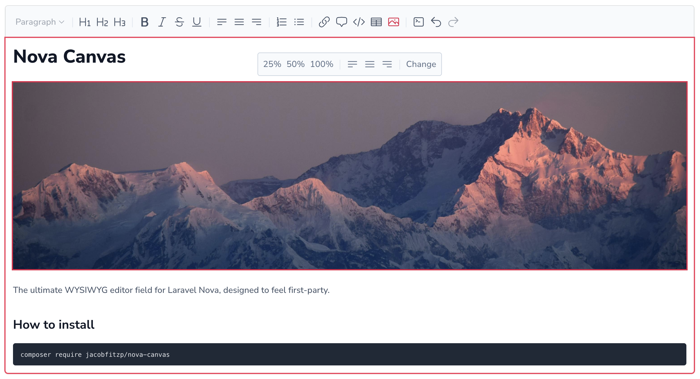

# Nova Canvas




<a href="https://codeclimate.com/github/JacobFitzp/nova-canvas/maintainability"></a>

## Features

- 🔧 Fully configurable
- 🌄 Image uploads
- 🎨 Light and dark mode

## Prerequisites

- Laravel >= 11
- PHP >= 8.3
- Laravel Nova >= 4

## Installation

You can install the package via composer:

```shell
composer require jacobfitzp/nova-canvas
```

## Usage

```php
Canvas::make('Content')
```

[Visit documentation site here](jacobfitzp.github.io/nova-canvas-docs)

## License

The MIT License (MIT). Please see License File for more information.
